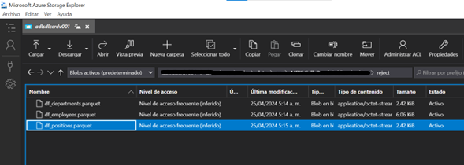
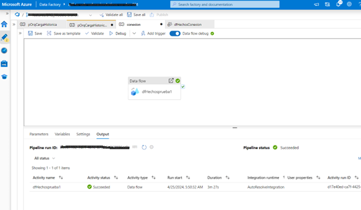
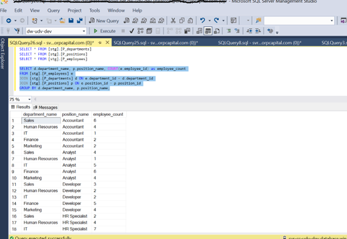

**Prueba GLOBAL MVM** 

**Data Scientis:**  _Ilbert Ferney Alarcon_ 😎 

  

 

# 1. Ingeniería de datos + Cloud.

• **DESAFIO #1:** Construya un script que genere de forma automática los datos de: departamentos, puestos de trabajo, y empleados. Considere el siguiente ejemplo (no es la única solución):

**Solución:** el script se desarrolló en PySpark en el servicio de Synapse Analitics de Azure, el Notebook genera las tablas y las traslada automáticamente a un Conteiner Storage de Azure en formato parquet

***Nota: el notebook es editado eliminando las credenciales de acceso***

  [Link Desarrollo Desafio 1](https://github.com/AlarconIlbert/GlobalMVM/blob/main/Desafio1.ipynb)

• **DESAFIO #2:** Guarde los datos simulados en archivos con formato CSV/Parquet. Explique el porqué de la escogencia del formato. No descarte usar la capa gratuita de algún servicio de almacenamiento tipo cloud, será considerado un plus.

**Solución:** Decidí tomar el formato **Parquet** por ser un formato columnar que está optimizado para el rendimiento y es especialmente útil para conjuntos de datos grandes, pese a que estos son datasets demasiado pequeños para garantizar la escalabilidad pensando en un crecimiento de los datos en mejor manejarlos como parquet por su eficiencia al comprimir los datos y realizar consultas más rápidas.

[df_departments.parquet](https://github.com/AlarconIlbert/GlobalMVM/blob/main/parquets/df_departments.parquet)
[df_employees.parquet](https://github.com/AlarconIlbert/GlobalMVM/blob/main/parquets/df_employees.parquet)
[df_positions.parquet](https://github.com/AlarconIlbert/GlobalMVM/blob/main/parquets/df_positions.parquet)

  

• DESAFIO #3: Implemente un proceso batch para migrar los datos a una base de datos SQL/NoSQL, o si lo desea, a un Datawarehouse o bucket analítico de un Datalake. No descarte usar la capa gratuita de algún servicio de almacenamiento tipo cloud, será considerado un plus.

  

  

  

  

  

• DESAFIO #4: Dependiendo si escoge una base de datos SQL/NoSQL, un Datawarehouse, o un Datalake, entonces desarrolle una view/query/report a partir del modelo de datos.

| department_name | position_name | employee_count |
|:-----------------|---------------|:----------------:|
| Sales           | Accountant    | 6              |
| Human Resources | Accountant    | 4              |
| IT              | Accountant    | 1              |
| Finance         | Accountant    | 2              |
| Marketing       | Accountant    | 2              |
| Sales           | Analyst       | 4              |
| Human Resources | Analyst       | 1              |
| IT              | Analyst       | 5              |
| Finance         | Analyst       | 6              |
| Marketing       | Analyst       | 4              |
| Sales           | Developer     | 3              |
| Human Resources | Developer     | 2              |
| IT              | Developer     | 2              |
| Finance         | Developer     | 5              |
| Marketing       | Developer     | 4              |
| Sales           | HR Specialist | 2              |
| Human Resources | HR Specialist | 4              |
| IT              | HR Specialist | 7              |
| Finance         | HR Specialist | 5              |
| Marketing       | HR Specialist | 1              |
| Sales           | Manager       | 6              |
| Human Resources | Manager       | 5              |
| IT              | Manager       | 4              |
| Finance         | Manager       | 7              |
| Marketing       | Manager       | 8              |

  [Resultado de la Consulta](https://github.com/AlarconIlbert/GlobalMVM/blob/main/Consulta.xlsx)

  [Script Creacion de Tablas](https://github.com/AlarconIlbert/GlobalMVM/blob/main/Create_Tables.sql)

  

  

• DESAFIO #5: Desarrolle una API REST para consultar la view/query/report. Para el desarrollo de la API considere algún framework de Python, C#/.Net.

**Solución:** Se decidio utilizar el framework de FASTAPI para el desarrollo de la API por agilidad en su elaboracion y su facil consulta por medio de Swagger
 [API](https://github.com/AlarconIlbert/GlobalMVM/blob/main/main.py)

## Documentación de la API

**Solución:** La API proporciona varios endpoints para interactuar con el de consulta de los empleados, sus departamentos y sus puestos de trabajo. A continuación se muestra una breve descripción de cada uno:

- `GET /API 1 Empleados-puesto/`: Esta consulta devuelve la cantidad de empleados que tienen un puesto específico
- `GET /API 2 Empleados-departamento/`:Esta consulta devuelve la cantidad de empleados en un departamento específico
- `GET /API 3 Puestos-departamento/`: Esta consulta devuelve todos los puestos disponibles en un departamento específico
- `GET /API 4 Departamentos-puesto/`:Esta consulta devuelve todos los departamentos que tienen al menos un empleado en un puesto específico
- `GET /API 5 Total-empleados/`:Esta consulta devuelve la cantidad total de empleados

  

• **DESAFIO #6:** Mejore la implementación de la API realizando un despliegue que use contenedores (valide las distintas opciones que le brinda su nube). Considere una prueba de consumo a la API implementando o activando algún front de acceso para ejecutar la invocación a la view/query/report.

**Solución:** Este desafio no me fue posible realizarlo ya que los recursos que tengo en Azure no me dan para desarroollarlo, sin embargo aqui dejo una breve descripcion de como lo haria en Azure:

Crea un grupo de recursos >> crear un appservice >> Crear webapp >> Desplegar webapp 

# 2. Modelamiento de datos para BI

• **DESAFIO #1**: Usando la herramienta Power BI Desktop y el conector OData deberá extraer los datos y crear un modelo dimensional que contemple las buenas prácticas. El modelo deberá asegurar un adecuado performance al ser consultado y reducir la redundancia en los datos. Registre en un
PDF/Word.

  [Modelado](https://github.com/AlarconIlbert/GlobalMVM/blob/main/Desafio%202/Desafio%202-1.pdf)

• **DESAFIO #2**: Diseñe un pequeño dashboard interactivo que visualice tres indicadores que considere los más relevantes para explicar los datos. Será un plus considerar el uso de filtros, inteligencia de tiempo, medidas DAX y una adecuada estética de colores y disposición de los elementos. Incluya una page oculta con las notas técnicas que expliquen, brevemente, porque el modelo diseñado está optimizado para un correcto rendimiento y para reducir al máximo la redundancia de los datos.

  [Dashboard](https://github.com/AlarconIlbert/GlobalMVM/blob/main/Desafio%202/Dashboard_Filtro1.pdf)

  [Dashboard_Editable](https://github.com/AlarconIlbert/GlobalMVM/blob/main/Desafio%202/Desafio2-2.pbix)

  [Filtro 1](https://github.com/AlarconIlbert/GlobalMVM/blob/main/Desafio%202/Dashboard_Filtro1.pdf)
  
  [Filtro 2](https://github.com/AlarconIlbert/GlobalMVM/blob/main/Desafio%202/Dashboard_Filtro2.pdf)